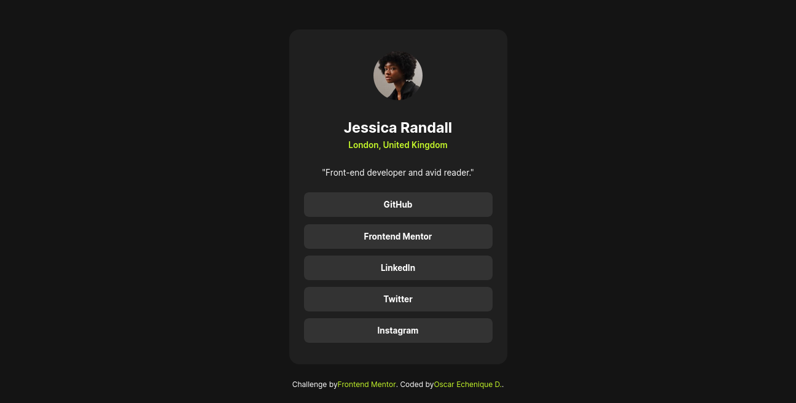

# Frontend Mentor - Social links profile solution

This is a solution to the [Social links profile challenge on Frontend Mentor](https://www.frontendmentor.io/challenges/social-links-profile-UG32l9m6dQ). Social links profile built with semantic HTML, CSS, pseudoclasses, and responsive design. Includes social media icons and interactive styles. Mobile and desktop friendly, focused on accessibility, best practices, and professional presentation.

## Table of contents

- [Overview](#overview)
  - [The challenge](#the-challenge)
  - [Screenshot](#screenshot)
  - [Links](#links)
- [My process](#my-process)
  - [Built with](#built-with)
  - [What I learned](#what-i-learned)
  - [Continued development](#continued-development)
  - [Useful resources](#useful-resources)
- [Author](#author)
- [How to Run Locally](How-to-Run-Locally)

## Overview

### The challenge

---

#### Challenges and Development Objectives

As part of this Frontend Mentor challenge, I approached the development of the profile card by breaking it down into clearly defined components and technical objectives. This allowed me to better structure my work and focus on writing semantic, accessible, and scalable HTML and CSS. My goals were not just to replicate the visual layout but to do so following modern web development practices and methodologies.

Here’s how I structured my approach:

##### 1. **Semantic HTML Structure**

I focused on creating a solid semantic foundation using elements like `<article>`, `<header>`, `<section>`, `<nav>`, and `<figure>`, ensuring that each part of the card had meaningful structure. Accessibility was a priority from the start, so I incorporated visually hidden elements such as `<figcaption>` to provide additional context for screen readers without affecting visual design.

##### 2. **Componentization by Functionality**

I organized the profile card into reusable, self-contained blocks:

- **Avatar Block**: Built using `<figure>` and styled to maintain aspect ratio and responsive sizing.
- **Header Block**: Contained the user’s name and location, with typographic hierarchy using `<h1>` and `<p>`.
- **Bio Block**: A short descriptive line styled as secondary information.
- **Social Links Navigation**: A `<nav>` element containing a list of links styled as buttons, with accessible `aria-labels` for clarity.

##### 3. **Responsive Design**

I made sure the layout was fully responsive across all screen sizes, starting from the base design sizes (mobile at 375px and desktop at 1440px) and expanding support from 320px up to larger screens. I used `max-width`, fluid units (`%`, `rem`, `vw`), and CSS Grid to allow elements like the social buttons to scale and reflow naturally without breaking the design.

##### 4. **Button Behavior and Fluid Layout**

One specific challenge was ensuring that each social link behaved like a true button. I applied styles directly to the `<a>` elements within list items and ensured they expanded to fill the width of their container (`display: block`, `width: 100%`). These buttons also adapt fluidly to the width of their container while maintaining consistent padding, alignment, and spacing.

##### 5. **CSS Architecture Using BEM**

To keep the codebase organized and scalable, I applied the BEM (Block Element Modifier) methodology for class naming. This helped me clearly separate styles by component, improve maintainability, and avoid class collisions, especially as the layout grows or evolves.

##### 6. **Accessibility and Interaction States**

All interactive elements support hover and focus states to meet usability standards. This was achieved using `:hover` and `:focus-visible` selectors, with accessible color contrast based on the provided color palette. I also considered WCAG guidelines when testing the layout across various screen sizes and devices.

##### 7. **Typography and Visual Design**

Typography was implemented using the Inter font family, and I ensured consistent sizing and weight as defined by the style guide (e.g., 14px for paragraph text). Proper vertical spacing between elements (like the bio and social links) was also preserved to maintain visual clarity.

### Screenshot



This screenshot shows the desktop version of the card. The design adapts seamlessly to smaller screens, maintaining visual clarity and accessibility.

### Links

- **Solution URL:** [GitHub Repository - Blog preview card](https://github.com/OscarE2D/FrontendMentor-Social-links-profile)
- **Live Site URL:** [GitHub Page - Blog preview card](https://oscare2d.github.io/FrontendMentor-Social-links-profile/)

## My process

### Built with

- Semantic HTML5 markup
- CSS custom properties
- Flexbox
- CSS Grid
- Mobile-first workflow
- BEM methodology (Block, Element, Modifier)

### What I learned

---

Today I had the chance to dive deeper into several important aspects of web development, especially focusing on semantic HTML, accessibility, responsive design, and CSS best practices. It all started with a seemingly simple task: building a profile card with social media links. But along the way, I discovered many nuances that helped me improve and refine how I structure and think about code.

To begin with, I learned how to properly organize HTML using semantic tags like `<article>`, `<header>`, `<section>`, `<nav>`, `<figure>`, and `<figcaption>`. The main component was wrapped inside an `<article>`, which makes sense since it represents a self-contained and reusable unit. Inside it, the `<header>` grouped the image, name, and location of the person. Then, a short biography was placed in a `<section>`, and the social media links were listed inside a `<nav>`, which also makes a lot of sense from an accessibility and document structure point of view.

Another detail I refined was the use of `<figcaption>`. I learned that it doesn't always have to be visible—it can be hidden accessibly using a class like `.visually-hidden`. This is useful when we want to keep content available for screen readers without showing it visually. I also wondered if I could replace the profile title (`<h1>`) with the `<figcaption>`, but I concluded that it’s not ideal. The heading plays a more important role in terms of hierarchy and navigation for both users and search engines.

Moving on to CSS, I worked with links inside list items (`<li><a></a></li>`) and focused on making them look and behave like buttons. I found that it’s best to apply styles directly to the `<a>` element since that’s where the interaction happens. To make the links take up the full width of the container (in this case a `<nav>`), I used `display: block` and `width: 100%`. And if I want them to adapt fluidly to the available space, I learned not to rely only on `max-width: 100%`, but to also apply `width: 100%`.

A key insight was understanding how fluid design works and how elements behave inside containers with fixed widths. It became clear that if a parent element has a specific width, its children will be constrained by it—so I need to be careful with how components fit together, especially when aiming for responsiveness. I also reinforced the use of `box-sizing: border-box`, which always helps keep width under control without surprises from paddings or borders.

A big step forward was properly applying the BEM methodology (Block, Element, Modifier). I was already familiar with it, but this time I used it more consciously to keep everything organized and readable. It was much easier to work with class names like `.profile-card__avatar` or `.profile-card__name`, and instantly understand what each one does and which part of the component it belongs to.

Lastly, I made good progress in working with CSS Grid. I had used it before, but in this practice I focused on using it more effectively to distribute elements and create a layout that adapts well to different screen sizes. Seeing how to control columns, rows, and content areas gave me much more confidence to build clean and structured designs.

In summary, today was a highly productive day. Beyond the visual result, the most valuable part was reinforcing best practices, improving my approach to accessibility, gaining a deeper understanding of how responsive design works in different contexts, and continuing to refine how I write HTML and CSS in a professional yet practical and scalable way.

### Continued development

---

After completing this challenge and going through the learning process, I’ve realized there are still key areas I need to keep strengthening in order to solidify my skills in web development—particularly in HTML and CSS.

One of the main aspects I want to continue working on is the **BEM methodology** (Block Element Modifier). Although I’ve made good progress understanding its structure, I’m interested in digging deeper into how to properly name and group class names, how to avoid interpreting BEM as a strict hierarchy (which it isn’t), and how to keep a clear and maintainable semantic structure in real-world projects. I still run into doubts when combining BEM with complex or reusable structures, so I’ll keep practicing and looking for well-implemented examples to internalize it further.

I also want to continue improving my understanding and use of **semantic HTML**. This goes beyond knowing the tags and their definitions—it's about truly understanding **when it's appropriate to use one tag over another**, when they can be interchangeable without losing accessibility or logical structure, and how they affect user experience and how content is interpreted by assistive technologies or search engines. Choosing between a `section`, `div`, or `article` may seem trivial, but it carries real implications, so I want to develop clearer criteria for making these decisions.

Another area I’ll keep focusing on is **fluid and responsive design**. While I’ve applied concepts like `max-width`, `width: 100%`, and relative units, I know I still need to improve how I structure content so it adapts naturally to different screen sizes. This includes refining my use of `media queries` and strategically planning the behavior and layout of elements (buttons, text blocks, lists) as the screen resizes.

Additionally, I’ve realized I still need to improve my ability to **plan components or sections with clear development goals**, like I did with the profile card. Being able to break down and visually organize the elements before writing a single line of code is essential to avoid getting stuck or encountering ambiguities halfway through.

Lastly, I want to keep polishing my knowledge of **CSS Grid**, especially when it comes to more advanced combinations, nested layouts, and how to use it effectively alongside Flexbox to build more solid and scalable structures. While I have a solid foundation, I know a more refined use of grid layout can make a big difference in future projects.

### Useful resources

#### 1. **Git Immersion**

---

🔗 [https://gitimmersion.com/](https://gitimmersion.com/)  
📘 _A practical, step-by-step guide to mastering Git._  
This site goes beyond just listing commands — it walks you through practical exercises and real examples. Perfect for understanding not just the "how," but the "why" behind Git.

---

#### 2. **Learn CSS Grid**

🔗 [https://learncssgrid.com/](https://learncssgrid.com/)  
📘 _A comprehensive, beginner-friendly guide to mastering CSS Grid._  
This site offers a clean, progressive learning path through all the essential concepts of CSS Grid. It uses clear examples and visual demos to help you build strong layout skills from the ground up.

---

#### 3. **CSS-Tricks: A Complete Guide to Grid**

🔗 [https://css-tricks.com/snippets/css/complete-guide-grid/](https://css-tricks.com/snippets/css/complete-guide-grid/)  
📘 _A thorough, visual reference for all CSS Grid properties and features._  
This guide is perfect for both quick lookups and deeper learning. It includes diagrams, live examples, and clear explanations of both implicit and explicit grid behavior.

---

#### 4. **Modern HTML Explained For Beginners** – _by HTML Academy_

🔗 [https://htmlacademy.org/blog/html/semantic-html-guide](https://htmlacademy.org/blog/html/semantic-html-guide)
📘 _Explains how to use semantic HTML in modern development._
Focused on current best practices in HTML5, this guide shows how semantic tags improve SEO, accessibility, and clear structure. Great for strengthening your HTML fundamentals with a modern approach.

---

#### 5. **Every Layout – Intrinsic Design Patterns**

🔗 [https://every-layout.dev/](https://every-layout.dev/)
📘 _Teaches CSS design patterns with a functional and modern approach._
Learn to use tools like `clamp()`, `flex`, `grid`, and other advanced CSS features through a philosophy of simplicity and adaptability — without over-relying on media queries.

---

#### 6. **You Might Not Need JavaScript**

🔗 [https://youmightnotneedjs.com/](https://youmightnotneedjs.com/)
📘 _Shows how many common interactions can be achieved with just HTML and CSS._
A great resource for learning modern attributes and performance techniques. Helps you write simpler, lighter code by reducing unnecessary JavaScript usage.

## Author

- Website - [Oscar Echenique D.](https://github.com/OscarE2D)
- Frontend Mentor - [@OscarE2D](https://www.frontendmentor.io/profile/OscarE2D)

## How to Run Locally

1. Clone the repository:

```bash
git clone https://github.com/OscarE2D/FrontendMentor-Social-links-profile
```
